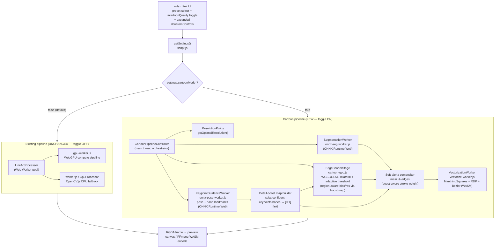
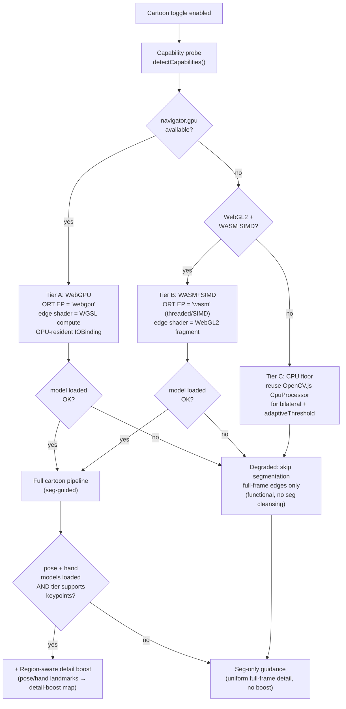
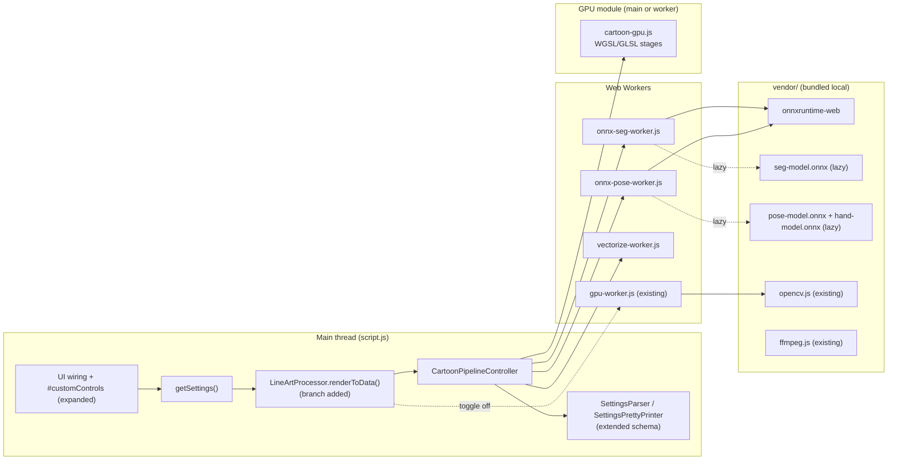
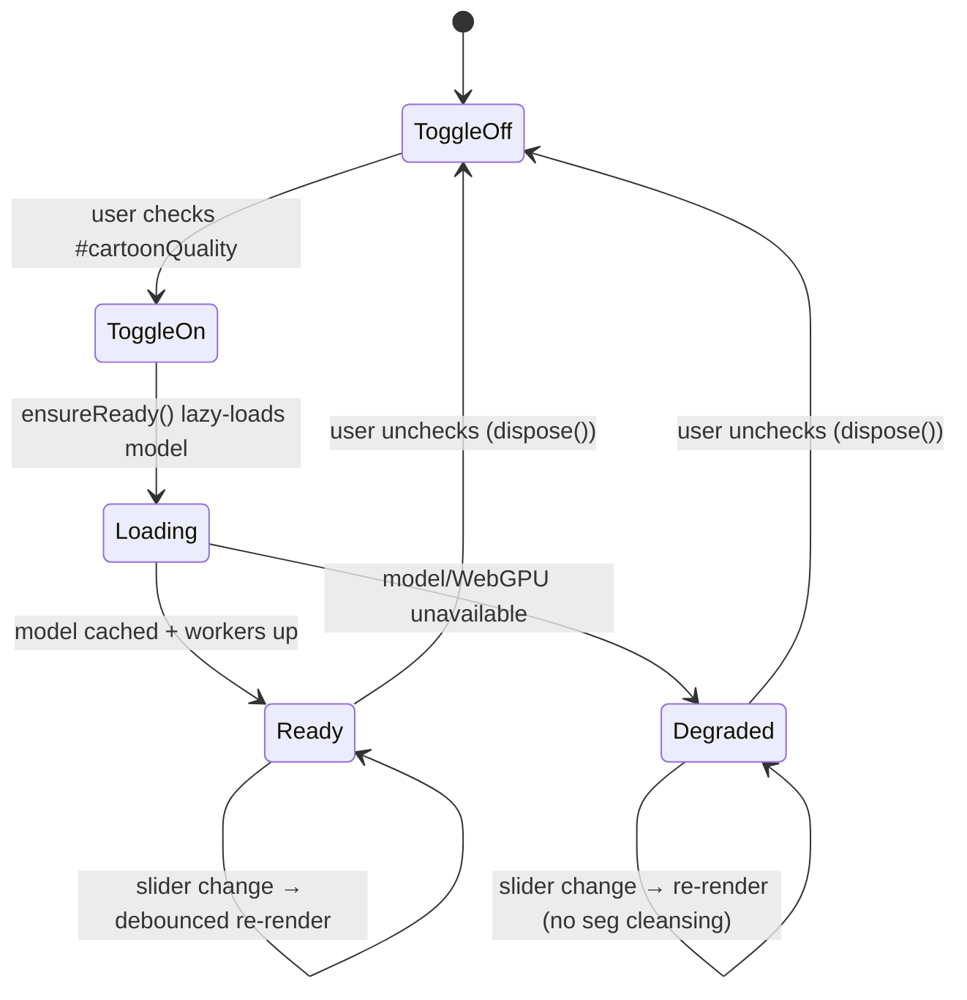

# Design Document: Cartoon Quality Pipeline

## Overview

The Cartoon Quality Pipeline adds an **optional**, quality-first line-art mode to the existing
browser-based Line Art Animator (`linearty.wecanuseai.com`). It is gated behind a single
**"Cartoon Quality" toggle** that is **off by default**. When the toggle is off the application
behaves exactly as it does today: existing presets (`manga`, `studio`, `neon`, `warm`, `vivid`,
`blueprint`, `custom`), the GPU/CPU worker pool (`gpu-worker.js` → `worker.js` fallback), preview,
and FFmpeg-WASM video export are completely unchanged. When the toggle is on, frames are routed
through a new cartoon pipeline tuned for crisp, hand-drawn-style human line art.

The cartoon pipeline trades raw throughput for edge continuity and clean styling. Its core stages
are: (1) **bilateral filtering first** to strip micro-textures while keeping structural boundaries
sharp, implemented as a WebGL/WebGPU fragment/compute shader rather than a single-threaded OpenCV
loop; (2) **adaptive thresholding** with a large block size to normalize local lighting and kill
temporal line flicker; (3) **human-segmentation guidance** via ONNX Runtime Web running a quantized
background-removal model (RMBG-1.5 or BiRefNet-mini, INT8/FP16, <50 MB) used as a *soft* spatial
alpha map multiplied over the full-frame edge layer — never a hard crop; and (4) **vectorization**
(Marching Squares → Ramer-Douglas-Peucker → cubic Bézier) running in a Web Worker for crisp,
vector-illustrator-style curves.

Layered **on top of** segmentation is an optional, additive (5) **pose + hand-landmark guidance**
stage that performs **region-aware detail boosting**. A keypoint model (full-body pose, e.g.
BlazePose/MoveNet at ~17–33 joints) and a hand-landmark model (~21 points per hand) run client-side
and produce **sparse keypoints** — not a silhouette and not edges. The pipeline splats those
keypoints into a low-resolution **detail-boost map** that marks *where* small, detail-dense anatomy
lives (hands, fingers, joints, limbs). In those regions the edge and stroke parameters are locally
tuned for finer line work — higher local processing resolution, a lower adaptive-threshold bias, and
a finer stroke weight — because hands and fingers are small and otherwise lose detail under the
global resolution cap and the large adaptive-threshold block. The keypoints guide *where* to apply
finer line work; they never replace edge extraction, never draw the figure, and never suppress
background.

The two guidance stages are **complementary, not substitutes**. Segmentation produces a soft alpha
mask that only *fades background* edges (it is not an outline and does not draw the human; internal
subject detail already passes through at full fidelity). Keypoint guidance only *boosts local detail*
inside the subject. A skeleton alone cannot suppress background clutter, and a segmentation mask
alone cannot single out hands and fingers for extra detail — so the pipeline keeps both. Like
segmentation, the pose/hand stage is **optional and toggleable**, lazy-loads its models, respects the
tiered capability fallback, and **degrades gracefully**: if the keypoint models fail to load or
infer, detail boosting is skipped and the rest of the pipeline continues unchanged — it never
crashes.

The design also expands the existing **Custom / Experiment** section (`#customControls`) with
finer-grained controls and experimentation toggles for both the existing and new pipeline
parameters, all serializable through the existing `SettingsParser` / `SettingsPrettyPrinter`
round-trip and `localStorage` persistence pattern. Everything runs in a static, no-build-step
browser app (ES modules, Web Workers, WASM, WebGPU/WebGL, locally bundled vendor assets) deployed
to GitHub Pages — no backend.

### Goals

- Add a crisp, cartoon/anime-grade line-art mode optimized for human subjects.
- Maximize edge continuity and minimize temporal flicker across video frames.
- Preserve fine detail in small, hard-to-trace anatomy (hands, fingers, joints) via optional,
  region-aware detail boosting guided by pose and hand landmarks.
- Run entirely client-side with graceful degradation across desktop and mobile browsers.
- Expand experimentation controls without regressing existing behavior.

### Non-Goals (Explicit)

- **Does NOT replace** the existing pipeline. The cartoon pipeline is purely additive and
  opt-in. With the toggle off, output is byte-identical to today's output.
- **Does NOT require a backend.** No uploads, no server inference. All assets are bundled or
  lazy-loaded from a static origin/CDN.
- **Does NOT target sub-20 ms real-time.** The target is smooth *interactive* playback
  (≈720p @ 20 fps on desktop max-quality; ≈480p @ 30 fps on mobile), not real-time camera FX.
- Does not add new export formats; it reuses the existing PNG/MP4 export and FFmpeg-WASM encode.

### Terminology

| Term | Meaning |
|---|---|
| Standard pipeline | Existing `gpu-worker.js` WebGPU pipeline + `worker.js`/CpuProcessor fallback |
| Cartoon pipeline | New opt-in pipeline described in this document |
| Soft alpha mask | Upscaled + blurred segmentation probability map in `[0,1]`, multiplied over edges |
| Backend (inference) | ONNX Runtime Web execution provider: `webgpu` or `wasm` (NOT a server) |
| Keypoint guidance | Optional pose + hand-landmark stage that produces sparse anatomical keypoints (not edges, not a silhouette) |
| Pose landmarks | Full-body joint keypoints from a pose model (e.g. BlazePose 33 / MoveNet 17), each with `(x, y, score)` |
| Hand landmarks | 21 keypoints per detected hand (wrist + 5 fingers × 4 bones) with a left/right handedness label |
| Skeleton topology | The fixed, anatomically correct connectivity (bone list) linking pose joints and hand landmarks |
| Detail-boost map | A low-resolution scalar field in `[0,1]` marking where finer line work is applied; built by splatting confident keypoints/bones |
| Region-aware detail | Local tuning of edge/stroke params (higher local res factor, lower adaptive bias, thinner stroke) driven by the detail-boost map |

> **Two complementary guidance signals.** Segmentation answers *"where is the human"* and only
> **fades background** edges via the soft alpha mask. Keypoint guidance answers *"where is the
> small, detail-dense anatomy"* (hands, fingers, joints) and only **boosts local detail** inside the
> subject. Neither replaces edge extraction; neither draws the figure. The pose/hand stage layers
> **on top of** segmentation and never removes it.

---

## Architecture

### High-Level Toggle Branching

The single most important architectural property is the **clean branch on the toggle**. The toggle
state is read in `getSettings()` and carried on the settings object as `cartoonMode`. The
`LineArtProcessor`/render path inspects `cartoonMode` and dispatches to one of two completely
independent pipelines.



Both pipelines return the same artifact — an RGBA frame (`Uint8ClampedArray`) of identical
dimensions — so the downstream preview canvas, single-frame export, video export loop, and
FFmpeg-WASM streaming encode in `script.js` are reused without modification.

### Runtime / Backend Selection Hierarchy

ONNX Runtime Web is the unified inference layer. It auto-selects an execution provider; the
edge-extraction shader independently selects WebGPU or WebGL2. The pipeline degrades in well-defined
steps and never hard-fails.



**Tier policy summary**

| Tier | Detection | ORT execution provider | Edge shader | Notes |
|---|---|---|---|---|
| A — WebGPU | `navigator.gpu` + adapter | `webgpu` | WGSL compute | Preferred; keeps tensors GPU-resident |
| B — WASM+SIMD | WebGL2 + WASM SIMD | `wasm` (SIMD, threads if COOP/COEP) | WebGL2 fragment | iOS Safari, Android, low-spec |
| C — CPU floor | neither | n/a (segmentation skipped) | OpenCV.js bilateral + `adaptiveThreshold` | guaranteed functional output |

> COOP/COEP headers are not guaranteed on GitHub Pages, so ORT-WASM **multi-threading must be
> treated as optional**. The design assumes single-threaded SIMD WASM as the baseline and uses
> threads only when `crossOriginIsolated === true`.

> **Keypoint guidance is a strictly additive sub-layer.** Pose/hand landmark inference reuses the
> same ONNX Runtime Web tier as segmentation (`webgpu` on Tier A, `wasm`+SIMD on Tier B; skipped on
> the Tier C CPU floor to protect the budget). It runs **after** the seg-guided pipeline is already
> functional, so any failure (model load, inference, unsupported tier, low confidence) collapses to
> **seg-only guidance** — uniform full-frame detail — and never affects the byte path of the rest of
> the pipeline.

### Avoiding the GPU↔CPU "Black Screen" Round-Trip

A naive implementation reads the segmentation tensor back to CPU, then re-uploads pixels to the
edge shader, causing a visible stall ("black screen") and flicker. The design keeps image data
**GPU-resident between ONNX inference and the edge-extraction shader** on Tier A:

- ORT WebGPU EP exposes output tensors as GPU buffers via **IOBinding** (`ort.Tensor.location ===
  'gpu-buffer'`). The compositor consumes that buffer directly as a WGSL storage/texture binding —
  no `getData()` readback.
- The input frame is uploaded once to a GPU texture and shared by both the segmentation pre-process
  and the edge shader.
- **Documented fallback:** when IOBinding is unavailable (Tier B WASM, or ORT version without GPU
  output tensors), the mask is read back to a CPU `Float32Array` once per frame and uploaded as a
  texture for the WebGL2 compositor. This is the unavoidable round-trip; it is bounded to a single
  low-resolution mask transfer (segmentation runs at reduced resolution, see ResolutionPolicy).

### Component Inventory and Integration Points



**Concrete integration points in existing code:**

- `index.html` — add the `#cartoonQuality` toggle near `#preset`; add a `#cartoonControls` group and
  expand `#customControls`. The pose/hand guidance controls (enable toggle, hand-detail strength,
  joint-detail strength, confidence threshold) are added inside `#cartoonControls`. No structural
  change to the existing controls.
- `script.js` `getSettings()` — add `cartoonMode` plus the cartoon parameter block (additive keys),
  including the additive pose/hand keys.
- `script.js` `LineArtProcessor.renderToData()` / `render()` — add an early branch: if
  `settings.cartoonMode`, delegate to `CartoonPipelineController.renderFrame(...)`; otherwise the
  existing worker-pool dispatch runs untouched.
- `script.js` `SettingsParser`/`SettingsPrettyPrinter` — extend the validated/printed schema with the
  cartoon keys (only emitted when `cartoonMode` is true, mirroring how `customMode` keys are gated).
- `script.js` video export (`renderVideoExport`) and preview (`drawCurrentSource`/`render`) — no
  change; they call the same render entry point which now branches internally.
- `computeScaledSize()` — cartoon mode consults `ResolutionPolicy.getOptimalResolution()` for an
  additional cap on top of the existing dimension cap.

---

## Data-Flow Diagram (per frame, cartoon mode)

```mermaid
sequenceDiagram
    participant Main as CartoonPipelineController (main)
    participant Pol as ResolutionPolicy
    participant Seg as onnx-seg-worker.js
    participant Kp as onnx-pose-worker.js
    participant Edge as cartoon-gpu.js (WGSL/GLSL)
    participant Comp as Compositor
    participant Vec as vectorize-worker.js

    Main->>Pol: getOptimalResolution(isMobile, wantsMaxQuality)
    Pol-->>Main: { procW, procH, segW, segH, fpsCap }
    Note over Main: downscale source frame to procW×procH (≤1280×720)

    par Segmentation (low-res) and Keypoints (low-res) and Edge extraction (full-res)
        Main->>Seg: { frame@segW×segH }  (lazy-loads seg model on first call)
        Seg->>Seg: ORT run → mask probs [0,1] @ segW×segH
        Seg-->>Comp: soft mask (GPU buffer via IOBinding, or CPU Float32Array)
    and
        Main->>Kp: { frame@kpW×kpH }  (lazy-loads pose + hand models on first call)
        Kp->>Kp: ORT run → pose joints + hand landmarks (x,y,score) + handedness
        Kp->>Kp: validate anatomy (connectivity + confidence gate) → splat bones → detail-boost map [0,1]
        Kp-->>Edge: detail-boost map (region-aware bias/res factor)
        Kp-->>Comp: detail-boost map (region-aware stroke weight)
        Note over Kp: on failure / low confidence → empty boost map (seg-only guidance)
    and
        Main->>Edge: { frame@procW×procH, bilateral+adaptiveThresh params }
        Edge->>Edge: bilateral filter → adaptive threshold (locally biased by boost map) → edge layer
        Edge-->>Comp: edge intensity layer [0,1] @ procW×procH
    end

    Comp->>Comp: upscale+blur mask → softAlpha; edgeOut = edge * softAlpha
    alt vectorization enabled
        Comp->>Vec: { binary edge @ procW×procH, detail-boost map }
        Vec->>Vec: MarchingSquares → RDP(epsilon) → Bézier(smoothing); thinner stroke where boost high
        Vec-->>Main: vector paths → rasterize to RGBA
    else raster only
        Comp-->>Main: colorized RGBA (ink/bg)
    end
    Main->>Main: upscale RGBA to original frame size → preview / FFmpeg encode
```

Key sequencing decisions:

- Segmentation, keypoint detection, and edge extraction run **in parallel** and rendezvous at the
  edge stage / compositor. Both segmentation and keypoints run at a **lower resolution** than the
  edge stage because their outputs are coarse (a blurred mask / sparse points splatted into a
  low-res boost map); this bounds mobile cost.
- The compositor multiply (`edge * softAlpha`) is the operation that guarantees the
  "never increase edge intensity outside the human boundary" correctness property — multiplication
  by a value in `[0,1]` is monotone non-increasing.
- The **detail-boost map** is a *parameter modulation* signal, not a pixel layer: it locally lowers
  the adaptive-threshold bias / raises the local resolution factor in the edge stage and thins the
  stroke weight in vectorization. It can only *add* fine detail inside confident anatomy and is empty
  (all-zero) whenever keypoints are unavailable, so the seg-only path is the well-defined fallback.
- Vectorization is the last, optional stage and always runs in a Worker so the UI thread never
  blocks on tracing.

---

## Components and Interfaces

All code is JavaScript (ES modules) for browser execution; shader bodies are WGSL (Tier A) with a
GLSL ES 3.0 equivalent (Tier B). No build step — modules are loaded directly and workers via
`new Worker(url, { type: 'module' })`.

### Component 1: CartoonPipelineController (main thread)

**Purpose**: Orchestrates the cartoon pipeline for a single frame; owns the segmentation worker,
edge shader stage, vectorization worker, and resolution policy. Created lazily the first time
`cartoonMode` becomes true; torn down when the toggle is turned off.

```javascript
interface CartoonSettings {
  cartoonMode: boolean;                 // master toggle (false => never used)
  bilateralStrength: number;            // 0..100  (sigma mapping)
  bilateralRadius: number;              // 1..7    (kernel radius in px)
  adaptiveBlockSize: number;            // odd 9..151 (local window)
  adaptiveC: number;                    // -20..20 (threshold bias)
  segEnabled: boolean;                  // segmentation guidance on/off
  segSoftness: number;                  // 0..40   (mask blur radius px)
  segFadeStrength: number;              // 0..1    (background fade amount)
  lineWeight: number;                   // 1..5    (dilation)
  vectorize: boolean;                   // enable Marching Squares vectorization
  rdpEpsilon: number;                   // 0.5..8  (RDP simplification tolerance)
  bezierSmoothing: number;              // 0..1    (corner rounding amount)
  qualityProfile: 'maxQuality' | 'balanced';  // resolution/fps policy selector

  // ----- pose + hand-landmark guidance (additive, layered atop segmentation) -----
  poseHandEnabled: boolean;             // master toggle for keypoint detail guidance (default false)
  handDetailStrength: number;          // 0..1  detail boost around hands/fingers (default 0.8)
  jointDetailStrength: number;         // 0..1  detail boost around body joints/limbs (default 0.4)
  keypointConfidence: number;          // 0..1  min landmark score to count as valid (default 0.5)
}

class CartoonPipelineController {
  constructor(deps?: { isMobile?: boolean });

  // Process one RGBA frame. Returns RGBA of the SAME width/height as input.
  // Mirrors LineArtProcessor.renderToData()'s contract so it is a drop-in branch.
  async renderFrame(
    rgba: Uint8ClampedArray, width: number, height: number, settings: CartoonSettings
  ): Promise<{ data: Uint8ClampedArray, usedGpu: boolean, degraded: boolean }>;

  // Lazy init: probes capabilities, spins up workers, kicks off model download.
  async ensureReady(settings: CartoonSettings): Promise<void>;

  // Release workers, GPU buffers, and cached model when toggle turns off.
  dispose(): void;
}
```

**Responsibilities**: capability detection; resolution decision; fan-out to segmentation + edge
stages; compositing; optional vectorization; upscaling back to source resolution; degradation
handling (catch + fall back, never throw to the render loop).

### Component 2: SegmentationWorker (`onnx-seg-worker.js`)

**Purpose**: Runs ONNX Runtime Web with a quantized background-removal model, returning a soft
human-probability mask. Lazy-loads the model only on first use.

```javascript
// Message protocol (mirrors gpu-worker.js style: {type, id, ...}).
type SegInit   = { type: 'init', backendPref: 'webgpu' | 'wasm', modelUrl: string };
type SegResult = { type: 'seg-ready' }
               | { type: 'mask', id: number, mask: Float32Array | GPUBuffer,
                   maskW: number, maskH: number, location: 'cpu' | 'gpu-buffer' }
               | { type: 'seg-error', id?: number, message: string };

class SegmentationModel {
  // Returns false (not throw) if no backend/model is available → triggers degraded mode.
  async init(backendPref: 'webgpu' | 'wasm', modelUrl: string): Promise<boolean>;

  // Run inference. Output is a single-channel probability map in [0,1].
  async infer(rgba: Uint8Array, w: number, h: number):
    Promise<{ mask: Float32Array | GPUBuffer, maskW: number, maskH: number,
              location: 'cpu' | 'gpu-buffer' }>;
}
```

**Responsibilities**: ORT session creation with EP fallback (`['webgpu','wasm']`); model fetch +
cache (Cache Storage API); letterbox/normalize preprocessing; IOBinding GPU output when available;
returning a CPU `Float32Array` otherwise.

### Component 3: EdgeShaderStage (`cartoon-gpu.js`)

**Purpose**: GPU edge extraction = bilateral filter (first) → adaptive threshold (large block).
WGSL compute on Tier A; GLSL ES 3.0 fragment shader on Tier B; OpenCV.js fallback on Tier C.

```javascript
class EdgeShaderStage {
  constructor(backend: 'webgpu' | 'webgl2' | 'cpu');
  async init(): Promise<void>;

  // Produces an edge-intensity layer in [0,1]. On Tier A may return a GPU buffer
  // handle; on Tier B/C returns a Float32Array (or Uint8 mask).
  // `detailBoost` (optional) is a low-res [0,1] field that locally lowers the adaptive
  // bias and raises the effective resolution factor where confident anatomy was detected;
  // when omitted/empty the stage runs a uniform full-frame pass (seg-only guidance).
  async extractEdges(
    frame: GPUTexture | ImageData, w: number, h: number,
    params: { bilateralSigmaSpace: number, bilateralSigmaRange: number,
              bilateralRadius: number, adaptiveBlockSize: number, adaptiveC: number },
    detailBoost?: { data: Float32Array | GPUBuffer, w: number, h: number }
  ): Promise<{ edges: GPUBuffer | Float32Array, location: 'gpu-buffer' | 'cpu' }>;
}
```

**Responsibilities**: own WGSL/GLSL pipelines for bilateral + adaptive threshold; reuse the input
GPU texture shared with segmentation (Tier A); deterministic output equivalent across backends
within tolerance.

### Component 4: VectorizationWorker (`vectorize-worker.js`)

**Purpose**: Convert the binary edge mask to smooth vector strokes: Marching Squares contour
tracing → Ramer-Douglas-Peucker simplification → cubic Bézier smoothing, then rasterize to RGBA (or
emit SVG path data for future use). Runs entirely in a Worker.

```javascript
type VecRequest = { type: 'vectorize', id: number, mask: Uint8Array, w: number, h: number,
                    rdpEpsilon: number, bezierSmoothing: number, lineWeight: number,
                    ink: [number,number,number], bg: [number,number,number] };
type VecResult  = { type: 'paths', id: number, data: Uint8ClampedArray }   // rasterized RGBA
                | { type: 'vec-error', id: number, message: string };

class Vectorizer {
  traceContours(mask: Uint8Array, w: number, h: number): Point[][];   // Marching Squares
  simplify(path: Point[], epsilon: number): Point[];                  // RDP
  toBezier(path: Point[], smoothing: number): BezierSegment[];        // Catmull-Rom → cubic Bézier
  rasterize(curves: BezierSegment[][], w: number, h: number, style): Uint8ClampedArray;
}
```

**Responsibilities**: robust contour tracing for thin/branching edges; epsilon-controlled
simplification; smoothing that never introduces self-intersections beyond a bound; rasterization to
the same RGBA contract.

### Component 5: ResolutionPolicy (pure module, testable in Node)

**Purpose**: Decide processing/segmentation resolution and FPS cap. Pure function, no DOM — added to
`src/logic.js` for unit + property tests alongside `computeThresholds`.

```javascript
interface ResolutionDecision {
  procW: number; procH: number;   // edge-stage resolution, capped at 1280×720
  segW: number;  segH: number;    // segmentation input (model-native, e.g. 320 or 512)
  fpsCap: number;                 // playback/export fps cap
}

function getOptimalResolution(
  srcW: number, srcH: number, isMobile: boolean, userWantsMaxQuality: boolean
): ResolutionDecision;
```

### Component 6: KeypointGuidanceStage (`onnx-pose-worker.js` + detail-boost builder)

**Purpose**: Runs pose and hand-landmark inference (ONNX Runtime Web, same tier as segmentation),
validates the results against the anatomical model, and splats the **confident** landmarks/bones
into a low-resolution **detail-boost map** that the edge stage and vectorizer use for region-aware
detail. It produces **sparse keypoints**, never edges and never a silhouette. It is fully optional:
on any failure or low-confidence frame it returns an empty boost map and the pipeline runs seg-only.

```javascript
// Message protocol (mirrors the seg-worker style: {type, id, ...}).
type KpInit   = { type: 'init', backendPref: 'webgpu' | 'wasm',
                  poseModelUrl: string, handModelUrl: string };
type KpResult = { type: 'kp-ready' }
              | { type: 'landmarks', id: number, pose: Landmark[], hands: Hand[] }
              | { type: 'kp-error', id?: number, message: string };

interface Landmark { x: number; y: number; score: number; }      // x,y normalized to [0,1]
interface Hand { handedness: 'Left' | 'Right'; score: number; landmarks: Landmark[]; } // 21 pts

class KeypointGuidanceModel {
  // Returns false (never throws) if no backend/model is available → seg-only guidance.
  async init(backendPref: 'webgpu' | 'wasm', poseModelUrl: string, handModelUrl: string): Promise<boolean>;

  // Run pose + hand inference at the keypoint model resolution. May return empty arrays.
  async infer(rgba: Uint8Array, w: number, h: number):
    Promise<{ pose: Landmark[], hands: Hand[] }>;
}

// Pure, DOM-free builder — added to src/logic.js for unit + property tests.
// Validates anatomy (connectivity + handedness + confidence), then splats confident
// bones/landmarks into a [0,1] field. Returns an all-zero map if nothing is valid.
function buildDetailBoostMap(
  pose: Landmark[], hands: Hand[], boostW: number, boostH: number,
  params: { handDetailStrength: number, jointDetailStrength: number, keypointConfidence: number }
): Float32Array;   // length boostW*boostH, values in [0,1]
```

**Responsibilities**: ORT session creation with EP fallback (`['webgpu','wasm']`); lazy model fetch +
Cache Storage; letterbox/normalize preprocessing; **anatomical validation** (reject landmarks below
the confidence threshold, reject implausible connectivity, respect left/right handedness); building a
bounded, normalized detail-boost map by splatting confident hand bones (strongest boost) and body
joints/limbs (weaker boost) with Gaussian falloff. The map is intentionally **low resolution** (the
edge stage upsamples it as a smooth modulation field), keeping cost and memory small.

---

## Data Models

### Extended Settings Schema

The cartoon keys are **additive** and only emitted/validated when `cartoonMode` is true (exactly the
pattern used today for `customMode` keys in `SettingsPrettyPrinter.print`). With `cartoonMode` false,
the serialized settings are byte-identical to the current schema.

```javascript
// Produced by getSettings() in script.js. Existing keys unchanged.
interface ProcessingSettings {
  // ----- existing (unchanged) -----
  preset: PresetObject;
  detail: number;        // 35..90
  lineWeight: number;    // 1..5
  scale: number;         // 0.1..2.0
  videoFps: number;
  isOriginalFps: boolean;
  customMode: boolean;
  // ...existing custom-mode keys (useBilateral, bilateralPasses, ... colorOpacity)

  // ----- NEW: cartoon block (present only when cartoonMode === true) -----
  cartoonMode: boolean;          // default false
  bilateralStrength: number;     // 0..100   default 60
  bilateralRadius: number;       // 1..7     default 3
  adaptiveBlockSize: number;     // odd 9..151 default 51
  adaptiveC: number;             // -20..20  default 7
  segEnabled: boolean;           // default true
  segSoftness: number;           // 0..40    default 12  (mask blur radius)
  segFadeStrength: number;       // 0..1     default 0.85
  cartoonLineWeight: number;     // 1..5     default 2
  vectorize: boolean;            // default true
  rdpEpsilon: number;            // 0.5..8   default 2.0
  bezierSmoothing: number;       // 0..1     default 0.5
  qualityProfile: 'maxQuality' | 'balanced';  // default 'balanced'

  // ----- pose + hand-landmark guidance (additive sub-block) -----
  poseHandEnabled: boolean;      // default false (layered atop segmentation)
  handDetailStrength: number;    // 0..1     default 0.8
  jointDetailStrength: number;   // 0..1     default 0.4
  keypointConfidence: number;    // 0..1     default 0.5
}
```

**Validation rules (extend `SettingsParser.validate`):**

- `adaptiveBlockSize` MUST be an odd integer in `[9, 151]` (OpenCV `adaptiveThreshold` requires odd
  block size; shader requires the same for symmetric windows).
- `bilateralStrength ∈ [0,100]`, `bilateralRadius ∈ [1,7]`, `adaptiveC ∈ [-20,20]`.
- `segSoftness ∈ [0,40]`, `segFadeStrength ∈ [0,1]`.
- `rdpEpsilon ∈ [0.5,8]`, `bezierSmoothing ∈ [0,1]`, `cartoonLineWeight ∈ [1,5]`.
- `qualityProfile ∈ {'maxQuality','balanced'}`.
- `poseHandEnabled` MUST be boolean; `handDetailStrength ∈ [0,1]`, `jointDetailStrength ∈ [0,1]`,
  `keypointConfidence ∈ [0,1]`.
- All cartoon keys (including the pose/hand sub-block) are validated **only when
  `cartoonMode === true`**; otherwise ignored, preserving backward compatibility with previously
  saved settings strings.

### Anatomical Model (Pose + Hand Landmark Topology)

The keypoint guidance stage is only meaningful if detail boosting follows **real human anatomy**.
The anatomical model is defined **explicitly and statically** so that detail is splatted along
anatomically correct bones (never arbitrary point clouds), and so that connectivity, handedness, and
confidence can be validated before any boosting occurs. These definitions live in `src/logic.js`
(pure, DOM-free) alongside `buildDetailBoostMap` and are unit/property tested.

**Body pose landmarks** (BlazePose 33-point topology; the MoveNet 17-point subset is a strict subset,
so the same connectivity table is used with missing indices treated as absent/low-confidence):

```javascript
// Canonical body landmark indices (BlazePose ordering). Left/right are the
// SUBJECT's left/right (mirror-aware), matching the model's output convention.
const POSE_LANDMARK = {
  NOSE: 0,
  LEFT_SHOULDER: 11, RIGHT_SHOULDER: 12,
  LEFT_ELBOW: 13,    RIGHT_ELBOW: 14,
  LEFT_WRIST: 15,    RIGHT_WRIST: 16,
  LEFT_HIP: 23,      RIGHT_HIP: 24,
  LEFT_KNEE: 25,     RIGHT_KNEE: 26,
  LEFT_ANKLE: 27,    RIGHT_ANKLE: 28
  // (face/foot detail indices omitted from boosting; they add no line-art value)
};

// Anatomically correct bone connectivity (joint pairs). A "bone" is a segment
// between two landmarks; detail is splatted ALONG these segments, never between
// unconnected joints. This is the body skeleton topology.
const POSE_BONES = [
  [11, 12],            // shoulder girdle
  [11, 13], [13, 15],  // left upper arm, forearm  → toward left wrist (hand handoff)
  [12, 14], [14, 16],  // right upper arm, forearm → toward right wrist (hand handoff)
  [11, 23], [12, 24],  // torso sides
  [23, 24],            // pelvis
  [23, 25], [25, 27],  // left thigh, shin
  [24, 26], [26, 28]   // right thigh, shin
];
```

**Hand landmarks** (MediaPipe Hands 21-point topology, per detected hand, with a `Left`/`Right`
handedness label). The 21 points are the wrist plus 4 bones for each of the 5 fingers — this is the
correct hand structure and is enforced during validation (a "hand" with a landmark count other than
21 is rejected):

```javascript
// 21 landmarks: 0 = wrist; each finger = 4 points (MCP → PIP → DIP → TIP).
const HAND_LANDMARK_COUNT = 21;
const HAND_FINGERS = {
  THUMB:  [1, 2, 3, 4],
  INDEX:  [5, 6, 7, 8],
  MIDDLE: [9, 10, 11, 12],
  RING:   [13, 14, 15, 16],
  PINKY:  [17, 18, 19, 20]
};
// Bones: wrist → each finger MCP, then the inter-joint segments along each finger.
const HAND_BONES = [
  [0,1],[1,2],[2,3],[3,4],        // thumb
  [0,5],[5,6],[6,7],[7,8],        // index
  [0,9],[9,10],[10,11],[11,12],   // middle
  [0,13],[13,14],[14,15],[15,16], // ring
  [0,17],[17,18],[18,19],[19,20]  // pinky
];
const HAND_HANDEDNESS = ['Left', 'Right'];   // exactly one per detected hand
```

**Anatomical validation rules** (applied in `buildDetailBoostMap` before any splatting):

- A landmark counts as **present** only when `score ≥ keypointConfidence`; below-threshold landmarks
  are treated as absent and contribute **no** boost.
- A **bone** is splatted only when **both** of its endpoints are present (confidence-gated). This is
  the connectivity invariant — detail is never drawn between an unconnected/low-confidence pair.
- A **hand** is accepted only when `handedness ∈ {'Left','Right'}` and `landmarks.length === 21`;
  otherwise the whole hand is discarded (implausible structure → no boost).
- Coordinates are normalized to `[0,1]`; landmarks outside `[0,1]²` are clamped, and a bone whose
  endpoints are degenerate (identical points) is skipped.
- Hands receive the strongest boost (`handDetailStrength`); body joints/limbs receive a weaker boost
  (`jointDetailStrength`). With **no** valid anatomy the map is all-zero → seg-only guidance.

### Intermediate Buffers

| Buffer | Type | Resolution | Range | Location |
|---|---|---|---|---|
| `sourceTexture` | GPU texture / ImageData | procW×procH (≤1280×720) | RGBA8 | GPU (A) / CPU (B,C) |
| `edgeLayer` | f32 buffer / Float32Array | procW×procH | `[0,1]` | GPU (A) / CPU (B,C) |
| `segMask` | f32 / Float32Array | segW×segH (model-native) | `[0,1]` | GPU buffer (A+IOBinding) / CPU |
| `softAlpha` | f32 buffer | procW×procH | `[0,1]` | GPU (A) / CPU (B,C) |
| `detailBoostMap` | f32 / Float32Array | boostW×boostH (low-res, e.g. ≤256) | `[0,1]` | CPU → upsampled in edge/vector stage |
| `compositeEdges` | f32 buffer | procW×procH | `[0,1]` | GPU (A) / CPU (B,C) |
| `binaryMask` | Uint8Array | procW×procH | `{0,255}` | CPU (input to vectorizer) |
| `outputRGBA` | Uint8ClampedArray | original W×H | RGBA8 | CPU (returned to render loop) |

> The `detailBoostMap` is deliberately **low resolution**: it is a smooth modulation field (splatted
> bones with Gaussian falloff), so the edge stage and vectorizer upsample it bilinearly. It only ever
> *adds* local detail inside confident anatomy and is all-zero whenever keypoints are unavailable.

### Model Asset Descriptor

```javascript
interface SegModelDescriptor {
  id: 'rmbg-1.5' | 'birefnet-mini';
  url: string;            // vendor/models/<id>.onnx  (served from static origin)
  inputSize: number;      // 320 | 512 (square letterbox)
  precision: 'int8' | 'fp16';
  approxBytes: number;    // budget guard, < 50_000_000
  cacheKey: string;       // Cache Storage key for offline reuse
}
```

Model is fetched on first cartoon activation, stored via the Cache Storage API, and reused on
subsequent loads. With the toggle off, the model is **never requested**, so cold app load is
unaffected.

### Keypoint Model Descriptors (Pose + Hand)

The pose and hand-landmark models are described the same way as the segmentation model and share the
same lazy-load + Cache Storage + size-guard machinery. They are fetched **only** when both
`cartoonMode` and `poseHandEnabled` are true, and **only** on a tier that supports keypoints (A/B).
Together they remain inside the existing <50 MB-class budget (landmark models are small — typically a
few MB each).

```javascript
interface KeypointModelDescriptor {
  kind: 'pose' | 'hand';
  id: 'blazepose-lite' | 'movenet-lightning' | 'mediapipe-hands';
  url: string;            // vendor/models/<id>.onnx  (same static origin)
  inputSize: number;      // square letterbox input (e.g. 192 | 256)
  precision: 'int8' | 'fp16';
  landmarkCount: number;  // pose: 17|33 ; hand: 21 (validated against the anatomical model)
  approxBytes: number;    // budget guard (sum of pose + hand stays < 50_000_000)
  cacheKey: string;       // Cache Storage key for offline reuse
}
```

If either keypoint model fails the size guard, fails to download/verify, or fails session creation,
the controller collapses to **seg-only guidance** (empty boost map) without entering full
`Degraded_Mode` — the seg-guided pipeline keeps running unchanged.

---

## Low-Level Design

### 1. Bilateral + Adaptive Threshold — WGSL (Tier A)

Stage 1 strips micro-textures with an edge-preserving bilateral filter; Stage 2 binarizes with a
large-block adaptive threshold to normalize local lighting. Two compute passes share the input
texture used by segmentation (no extra upload).

```wgsl
// ── Pass 1: bilateral filter (greyscale f32) ──────────────────────────────
// inv2ss = -0.5 / sigmaSpace^2  ; inv2sr = -0.5 / sigmaRange^2  (range normalised to [0,1])
struct BilParams { width:u32, height:u32, radius:u32, inv2ss:f32, inv2sr:f32 }
@group(0) @binding(0) var<storage, read>       src : array<f32>;
@group(0) @binding(1) var<storage, read_write> dst : array<f32>;
@group(0) @binding(2) var<uniform>             p   : BilParams;
@compute @workgroup_size(16,16)
fn bilateral(@builtin(global_invocation_id) gid: vec3<u32>) {
    let x = gid.x; let y = gid.y;
    if (x >= p.width || y >= p.height) { return; }
    let w = p.width; let cx = i32(x); let cy = i32(y); let r = i32(p.radius);
    let center = src[y*w + x];
    var sum = 0.0; var wsum = 0.0;
    for (var dy = -r; dy <= r; dy++) {
        for (var dx = -r; dx <= r; dx++) {
            let nx = u32(clamp(cx+dx, 0, i32(p.width)-1));
            let ny = u32(clamp(cy+dy, 0, i32(p.height)-1));
            let v  = src[ny*w + nx];
            let dv = v - center;
            let wt = exp(f32(dx*dx + dy*dy) * p.inv2ss) * exp(dv*dv * p.inv2sr);
            sum += v*wt; wsum += wt;
        }
    }
    dst[y*w + x] = sum / wsum;     // INVARIANT: 0<=wt<=1, wsum>0 => result in [min,max] of window
}

// ── Pass 2: adaptive threshold (mean-C, large block) → edge intensity [0,1] ──
// Mirrors OpenCV ADAPTIVE_THRESH_MEAN_C + THRESH_BINARY_INV semantics:
// edge = (pixel < localMean - C) ? 1 : 0, with a soft ramp to reduce flicker.
struct AdaptParams { width:u32, height:u32, block:u32, c:f32 }   // block is odd
@group(0) @binding(0) var<storage, read>       gray : array<f32>;
@group(0) @binding(1) var<storage, read_write> edge : array<f32>;
@group(0) @binding(2) var<uniform>             p    : AdaptParams;
@compute @workgroup_size(16,16)
fn adaptiveThreshold(@builtin(global_invocation_id) gid: vec3<u32>) {
    let x = gid.x; let y = gid.y;
    if (x >= p.width || y >= p.height) { return; }
    let w = p.width; let cx = i32(x); let cy = i32(y);
    let r = i32(p.block) / 2;
    var acc = 0.0; var n = 0.0;
    for (var dy = -r; dy <= r; dy++) {
        for (var dx = -r; dx <= r; dx++) {
            let nx = u32(clamp(cx+dx, 0, i32(p.width)-1));
            let ny = u32(clamp(cy+dy, 0, i32(p.height)-1));
            acc += gray[ny*w + nx]; n += 1.0;
        }
    }
    let localMean = acc / n;
    let cNorm = p.c / 255.0;
    // soft ramp over ~2/255 around the boundary kills 1-frame flicker vs hard step.
    edge[y*w + x] = clamp((localMean - cNorm - gray[y*w + x]) * 128.0 + 0.5, 0.0, 1.0);
}
```

> A separable box-mean (two 1-D prefix-sum passes) is the intended optimization for large
> `block` values; the naive window above is the reference semantics. Both must agree within
> tolerance (see Correctness Properties).

### 1b. GLSL ES 3.0 equivalent (Tier B, WebGL2 fragment)

```glsl
#version 300 es
precision highp float;
uniform sampler2D uGray;      // R channel = greyscale in [0,1]
uniform vec2  uTexel;         // 1.0 / vec2(width, height)
uniform int   uBlock;         // odd
uniform float uC;             // bias in 0..255 units
out vec4 fragColor;
void main() {
    ivec2 sz = textureSize(uGray, 0);
    vec2 uv = gl_FragCoord.xy * uTexel;
    int r = uBlock / 2;
    float acc = 0.0, n = 0.0;
    for (int dy = -r; dy <= r; dy++) {
        for (int dx = -r; dx <= r; dx++) {
            vec2 o = vec2(float(dx), float(dy)) * uTexel;
            acc += texture(uGray, clamp(uv + o, vec2(0.0), vec2(1.0))).r; n += 1.0;
        }
    }
    float localMean = acc / n;
    float center = texture(uGray, uv).r;
    float edge = clamp((localMean - uC/255.0 - center) * 128.0 + 0.5, 0.0, 1.0);
    fragColor = vec4(edge, edge, edge, 1.0);
}
```

### 1c. CPU floor (Tier C, OpenCV.js — reuses bundled `opencv.js`)

```javascript
// Pseudocode — runs in worker.js/CpuProcessor namespace when no GPU is available.
function cpuEdgeStage(grayMat, p) {
  const smoothed = new cv.Mat();
  // sigmaColor maps from bilateralStrength; d from bilateralRadius*2+1
  cv.bilateralFilter(grayMat, smoothed, p.bilateralRadius*2+1, p.sigmaColor, p.sigmaSpace);
  const edges = new cv.Mat();
  // block must be odd; THRESH_BINARY_INV so subject lines become foreground.
  cv.adaptiveThreshold(smoothed, edges, 255, cv.ADAPTIVE_THRESH_MEAN_C,
                       cv.THRESH_BINARY_INV, p.adaptiveBlockSize, p.adaptiveC);
  smoothed.delete();
  return edges; // Uint8 {0,255}; converted to [0,1] for the compositor
}
```

### 2. ONNX Runtime Web init + IOBinding texture passing (with WASM fallback)

```javascript
// onnx-seg-worker.js  (module worker)
import * as ort from './vendor/onnxruntime-web/ort.webgpu.min.js';

let session = null;
let backend = 'wasm';

// init() returns false (never throws) so the controller can degrade gracefully.
async function init(backendPref, modelUrl) {
  try {
    // Configure WASM paths for the no-build-step static deployment.
    ort.env.wasm.wasmPaths = './vendor/onnxruntime-web/';
    ort.env.wasm.simd = true;
    ort.env.wasm.numThreads = self.crossOriginIsolated ? Math.min(4, navigator.hardwareConcurrency||1) : 1;

    // EP preference list: prefer WebGPU, fall back to wasm automatically.
    const eps = backendPref === 'webgpu' ? ['webgpu', 'wasm'] : ['wasm'];

    const modelBuffer = await fetchWithCache(modelUrl);     // Cache Storage; download-once
    session = await ort.InferenceSession.create(modelBuffer, {
      executionProviders: eps,
      graphOptimizationLevel: 'all',
      // Keep outputs on the GPU when the WebGPU EP is active (IOBinding).
      preferredOutputLocation: backendPref === 'webgpu' ? { output: 'gpu-buffer' } : undefined,
    });
    backend = session.handler?.backend ?? backendPref;     // best-effort introspection
    return true;
  } catch (e) {
    console.warn('[seg] init failed, segmentation disabled:', e);
    session = null;
    return false;   // → controller runs degraded (full-frame edges, no seg cleansing)
  }
}

async function infer(rgba, w, h, inputSize) {
  // Preprocess: letterbox to inputSize×inputSize, normalize to model's expected range.
  const input = preprocessLetterbox(rgba, w, h, inputSize);    // Float32 NCHW
  const feeds = { input: new ort.Tensor('float32', input, [1, 3, inputSize, inputSize]) };

  const results = await session.run(feeds);
  const out = results.output;                                  // [1,1,inputSize,inputSize]

  if (out.location === 'gpu-buffer') {
    // ── GPU-RESIDENT PATH (no readback; avoids black-screen round-trip) ──
    // Hand the GPUBuffer straight to the compositor's WGSL bind group.
    return { mask: out.gpuBuffer, maskW: inputSize, maskH: inputSize, location: 'gpu-buffer' };
  } else {
    // ── DOCUMENTED FALLBACK (single low-res readback) ──
    const data = await out.getData();                          // Float32Array, CPU
    return { mask: data, maskW: inputSize, maskH: inputSize, location: 'cpu' };
  }
}

// Download-once with Cache Storage so the model is only fetched the first time
// the cartoon toggle is ever enabled.
async function fetchWithCache(url) {
  const cache = await caches.open('cartoon-models-v1');
  let resp = await cache.match(url);
  if (!resp) { resp = await fetch(url); if (resp.ok) await cache.put(url, resp.clone()); }
  return new Uint8Array(await resp.arrayBuffer());
}
```

**IOBinding contract**: On Tier A, `preferredOutputLocation: { output: 'gpu-buffer' }` keeps the mask
tensor on the GPU. The compositor binds `out.gpuBuffer` directly as a WGSL `storage` buffer — the
input frame texture is also already GPU-resident — so the entire seg→edge→composite path runs without
a CPU round-trip. The fallback path performs exactly **one** readback of the small `segW×segH` mask.

### 3. Soft-alpha mask compositing

The mask is upscaled to `procW×procH` and blurred (radius = `segSoftness`) to create a soft boundary,
then multiplied over the edge layer with a background-fade weight. Multiplication by a value in
`[0,1]` is the formal guarantee that edges are never amplified outside the human region.

```wgsl
// compositor.wgsl — edgeOut = edge * softAlpha   (softAlpha in [0,1])
struct CompParams { width:u32, height:u32, fadeStrength:f32 }
@group(0) @binding(0) var<storage, read>       edge      : array<f32>;  // [0,1] @ proc res
@group(0) @binding(1) var<storage, read>       softAlpha : array<f32>;  // [0,1] @ proc res (upscaled+blurred mask)
@group(0) @binding(2) var<storage, read_write> outEdge   : array<f32>;
@group(0) @binding(3) var<uniform>             p         : CompParams;
@compute @workgroup_size(16,16)
fn composite(@builtin(global_invocation_id) gid: vec3<u32>) {
    let x = gid.x; let y = gid.y;
    if (x >= p.width || y >= p.height) { return; }
    let i = y*p.width + x;
    // weight = 1 inside human (alpha=1); fades toward (1-fadeStrength) in background (alpha=0).
    let weight = mix(1.0 - p.fadeStrength, 1.0, clamp(softAlpha[i], 0.0, 1.0));
    outEdge[i] = edge[i] * weight;     // INVARIANT: outEdge[i] <= edge[i]  (monotone non-increasing)
}
```

```javascript
// Reference CPU/JS equivalent (Tier B/C and for property tests in src/logic.js):
function compositeSoftAlpha(edge, softAlpha, fadeStrength) {
  const out = new Float32Array(edge.length);
  for (let i = 0; i < edge.length; i++) {
    const a = Math.min(1, Math.max(0, softAlpha[i]));
    const weight = (1 - fadeStrength) + fadeStrength * a;   // in [1-fade, 1]
    out[i] = edge[i] * weight;                              // <= edge[i]
  }
  return out;
}
```

### 4. Vectorization: Marching Squares → RDP → Bézier

```javascript
// vectorize-worker.js — pure-data algorithm, runs off the UI thread.

// 4a. Marching Squares contour tracing on a binary mask {0,255}.
//   For each 2×2 cell, the 4-bit case index selects edge crossings; crossings
//   are linked into closed/open polylines. Output: array of point paths.
function traceContours(mask, w, h) {
  const paths = [];
  const visited = new Uint8Array(w * h);
  for (let y = 0; y < h - 1; y++) {
    for (let x = 0; x < w - 1; x++) {
      const idx = y * w + x;
      if (visited[idx]) continue;
      const code = cellCode(mask, x, y, w);        // 0..15 from 4 corner bits
      if (code === 0 || code === 15) continue;     // fully outside / inside
      paths.push(followContour(mask, x, y, w, h, visited));  // walk crossings to closure
    }
  }
  return paths;   // Point[][]
}

// 4b. Ramer-Douglas-Peucker simplification.
//   PRE: path.length >= 2, epsilon > 0
//   POST: returned points ⊆ path (endpoints preserved); max deviation <= epsilon;
//         result.length <= path.length
function rdp(path, epsilon) {
  if (path.length < 3) return path.slice();
  let maxD = 0, idx = 0;
  for (let i = 1; i < path.length - 1; i++) {
    const d = perpDistance(path[i], path[0], path[path.length - 1]);
    if (d > maxD) { maxD = d; idx = i; }
  }
  if (maxD > epsilon) {
    const left  = rdp(path.slice(0, idx + 1), epsilon);
    const right = rdp(path.slice(idx), epsilon);
    return left.slice(0, -1).concat(right);        // de-dup shared join point
  }
  return [path[0], path[path.length - 1]];
}

// 4c. Cubic Bézier smoothing via Catmull-Rom → Bézier conversion.
//   smoothing in [0,1] scales the tangent magnitude (0 = polyline corners,
//   1 = max rounding). Control points derived from neighbour midpoints so the
//   curve passes through every input point (interpolating spline).
function toBezier(points, smoothing) {
  const segs = [];
  const t = smoothing / 6.0;
  for (let i = 0; i < points.length - 1; i++) {
    const p0 = points[i - 1] || points[i];
    const p1 = points[i];
    const p2 = points[i + 1];
    const p3 = points[i + 2] || p2;
    segs.push({
      from: p1,
      c1: { x: p1.x + (p2.x - p0.x) * t, y: p1.y + (p2.y - p0.y) * t },
      c2: { x: p2.x - (p3.x - p1.x) * t, y: p2.y - (p3.y - p1.y) * t },
      to: p2
    });
  }
  return segs;   // BezierSegment[]
}

// 4d. Rasterize the smoothed curves into an RGBA frame at proc resolution,
//   then the controller upscales to original size. lineWeight => stroke width.
function rasterize(curveSets, w, h, style) { /* OffscreenCanvas 2D stroke, ink on bg */ }
```

Signatures and message contract for the worker are in Component 4. The worker receives the binary
edge mask, returns rasterized RGBA (`Uint8ClampedArray`) matching the standard render contract; SVG
path emission is reserved for a future export and is out of scope here.

### 5. Resolution-scaling policy

```javascript
// src/logic.js (pure, unit + property tested)
const PROC_CAP_W = 1280, PROC_CAP_H = 720;     // hard ceiling for ALL platforms

function getOptimalResolution(srcW, srcH, isMobile, userWantsMaxQuality) {
  // Target longest-edge budget by platform/profile.
  let maxLongEdge, fpsCap, segInput;
  if (isMobile) {
    maxLongEdge = 854;  fpsCap = 30; segInput = 320;          // mobile = 480p-class @ 30fps
  } else if (userWantsMaxQuality) {
    maxLongEdge = 1280; fpsCap = 20; segInput = 512;          // max-quality = 720p @ 20fps
  } else {
    maxLongEdge = 1280; fpsCap = 24; segInput = 512;          // balanced desktop
  }
  // Scale source down to fit the budget AND the absolute proc cap. Never upscale.
  const longest = Math.max(srcW, srcH);
  const ratio = Math.min(1, maxLongEdge / longest);
  let procW = Math.round(srcW * ratio);
  let procH = Math.round(srcH * ratio);
  // Enforce absolute cap (covers portrait/odd aspect ratios).
  const capRatio = Math.min(1, PROC_CAP_W / Math.max(procW, 1), PROC_CAP_H / Math.max(procH, 1));
  procW = Math.max(1, Math.round(procW * capRatio));
  procH = Math.max(1, Math.round(procH * capRatio));
  return { procW, procH, segW: segInput, segH: segInput, fpsCap };
}
```

`isMobile` is derived once at startup (`/Mobi|Android|iPhone|iPad/i.test(navigator.userAgent)` plus a
coarse `navigator.deviceMemory`/`hardwareConcurrency` check). On mobile the cap is **always** applied
regardless of `userWantsMaxQuality` (see Correctness Property C4).

### 6. Toggle + settings wiring (script.js integration)

```javascript
// getSettings() — additive block. With cartoonMode false, output schema is unchanged.
function getSettings() {
  const presetKey = elements.preset.value;
  const cartoonMode = document.getElementById('cartoonQuality').checked;   // NEW
  return {
    /* ...all existing keys exactly as today... */
    cartoonMode,
    ...(cartoonMode ? {
      bilateralStrength: Number(document.getElementById('cartoonBilateralStrength').value),
      bilateralRadius:   Number(document.getElementById('cartoonBilateralRadius').value),
      adaptiveBlockSize: toOdd(Number(document.getElementById('cartoonAdaptiveBlock').value)),
      adaptiveC:         Number(document.getElementById('cartoonAdaptiveC').value),
      segEnabled:        document.getElementById('cartoonSeg').checked,
      segSoftness:       Number(document.getElementById('cartoonSegSoftness').value),
      segFadeStrength:   Number(document.getElementById('cartoonSegFade').value) / 100,
      cartoonLineWeight: Number(document.getElementById('cartoonLineWeight').value),
      vectorize:         document.getElementById('cartoonVectorize').checked,
      rdpEpsilon:        Number(document.getElementById('cartoonRdpEpsilon').value),
      bezierSmoothing:   Number(document.getElementById('cartoonBezier').value) / 100,
      qualityProfile:    document.getElementById('cartoonMaxQuality').checked ? 'maxQuality' : 'balanced',
      // ----- pose + hand-landmark guidance (additive, layered atop segmentation) -----
      poseHandEnabled:    document.getElementById('cartoonPoseHand').checked,
      handDetailStrength: Number(document.getElementById('cartoonHandDetail').value) / 100,
      jointDetailStrength:Number(document.getElementById('cartoonJointDetail').value) / 100,
      keypointConfidence: Number(document.getElementById('cartoonKpConfidence').value) / 100
    } : {})
  };
}

// LineArtProcessor.renderToData() — single branch at the top; existing path untouched.
async renderToData(sourceCanvas, settings) {
  if (settings.cartoonMode) {
    const { width, height } = sourceCanvas;
    const img = sourceCanvas.getContext('2d', { willReadFrequently: true })
                            .getImageData(0, 0, width, height);
    this._cartoon ??= new CartoonPipelineController({ isMobile: IS_MOBILE });
    return await this._cartoon.renderFrame(img.data, width, height, settings); // {data, usedGpu, degraded}
  }
  /* ...existing worker-pool dispatch, unchanged... */
}
```

`SettingsPrettyPrinter.print` appends the cartoon block only when `settings.cartoonMode` is true
(same gating as `customMode`), and `SettingsParser.validate` applies the cartoon validation rules
only in that case — preserving round-trip and backward compatibility with older saved strings.

### 7. Keypoint anatomical validation + detail-boost map (`buildDetailBoostMap`)

This is the pure, DOM-free core of the keypoint stage (in `src/logic.js`, fully unit/property
tested). It enforces the anatomical model, then splats only **confident, anatomically valid** bones
into a low-resolution `[0,1]` field. It never throws and returns an all-zero map when nothing is
valid (the seg-only fallback).

```javascript
// src/logic.js — pure; validates anatomy then splats bones with Gaussian falloff.
function buildDetailBoostMap(pose, hands, boostW, boostH, params) {
  const { handDetailStrength, jointDetailStrength, keypointConfidence } = params;
  const map = new Float32Array(boostW * boostH);          // all-zero default = seg-only guidance

  const present = (lm) => lm && lm.score >= keypointConfidence
                       && lm.x >= 0 && lm.x <= 1 && lm.y >= 0 && lm.y <= 1;

  // splat a bone (segment between two present landmarks) with additive, clamped boost.
  const splatBone = (a, b, strength) => {
    if (!present(a) || !present(b)) return;               // CONNECTIVITY INVARIANT: both endpoints gated
    if (a.x === b.x && a.y === b.y) return;               // skip degenerate bone
    // sample along the segment; add Gaussian-falloff strength, clamped to [0,1].
    const steps = Math.max(2, Math.round(Math.hypot((b.x-a.x)*boostW, (b.y-a.y)*boostH)));
    for (let s = 0; s <= steps; s++) {
      const t = s / steps;
      const px = Math.round((a.x + (b.x-a.x)*t) * (boostW-1));
      const py = Math.round((a.y + (b.y-a.y)*t) * (boostH-1));
      stampGaussian(map, boostW, boostH, px, py, strength); // out = min(1, out + falloff*strength)
    }
  };

  // ── Body skeleton: weaker boost along anatomically correct bones only ──
  if (Array.isArray(pose)) {
    for (const [i, j] of POSE_BONES) splatBone(pose[i], pose[j], jointDetailStrength);
  }

  // ── Hands: strongest boost; reject implausible structure outright ──
  if (Array.isArray(hands)) {
    for (const hand of hands) {
      if (!HAND_HANDEDNESS.includes(hand.handedness)) continue;        // must be Left/Right
      if (!hand.landmarks || hand.landmarks.length !== HAND_LANDMARK_COUNT) continue; // must be 21 pts
      for (const [i, j] of HAND_BONES) splatBone(hand.landmarks[i], hand.landmarks[j], handDetailStrength);
    }
  }
  return map;   // values in [0,1]; all-zero ⟺ no valid anatomy
}
```

**How the map modulates the pipeline (region-aware detail):** the edge stage samples the upsampled
`detailBoostMap[i] ∈ [0,1]` per pixel and, where it is high, (a) lowers the effective adaptive bias
`adaptiveC` (so faint hand/finger lines survive thresholding), and (b) raises the local resolution
factor (so small anatomy is processed nearer source detail under the global cap). The vectorizer
thins the stroke weight where the boost is high (finer line work on fingers). Where the map is 0 the
stage runs the uniform full-frame pass — i.e. exactly today's seg-only behavior. Because the boost is
**additive and monotone** (it can only *raise* local detail), it can never erase or invert existing
line work.

---

## UI / Controls

### Cartoon Quality toggle

A dedicated toggle is added near the preset selector in `index.html`, off by default:

```html
<div class="control-group">
  <label class="toggle-label" for="cartoonQuality">
    <input type="checkbox" id="cartoonQuality">
    Cartoon Quality <span class="toggle-hint">(quality-first hand-drawn line art for human subjects — lazy-loads a segmentation model)</span>
  </label>
</div>
<div class="control-group" id="cartoonControls" hidden>
  <!-- bilateral strength/radius, adaptive block/C, segmentation softness/fade,
       line weight, vectorization (RDP epsilon + Bézier smoothing), max-quality toggle -->
  <!-- pose + hand-landmark guidance sub-group (layered atop segmentation) -->
  <fieldset id="poseHandControls">
    <legend>Pose &amp; Hand Detail (region-aware)</legend>
    <label><input type="checkbox" id="cartoonPoseHand"> Enable pose + hand detail boost</label>
    <label>Hand detail strength <input type="range" id="cartoonHandDetail" min="0" max="100" value="80"></label>
    <label>Joint detail strength <input type="range" id="cartoonJointDetail" min="0" max="100" value="40"></label>
    <label>Keypoint confidence <input type="range" id="cartoonKpConfidence" min="0" max="100" value="50"></label>
  </fieldset>
</div>
```

Toggling on reveals `#cartoonControls`, kicks off `CartoonPipelineController.ensureReady()` (which
lazy-loads the model), and re-renders the preview. Toggling off hides the controls, calls
`dispose()`, and restores the exact existing behavior.

**Cartoon control set** (`#cartoonControls`): bilateral strength, bilateral radius, adaptive block
size, adaptive C, segmentation toggle, segmentation softness (mask blur radius), background-fade
strength, line weight, vectorization toggle, RDP epsilon, Bézier smoothing, and a
**Max-quality vs Balanced** selector that drives `qualityProfile` → `ResolutionPolicy`.

**Pose &amp; hand guidance controls** (`#poseHandControls`, nested inside `#cartoonControls`, only
meaningful when segmentation guidance is already active):

| Control | Setting key | Range (UI → setting) | Default | Effect |
|---|---|---|---|---|
| Enable pose + hand detail | `poseHandEnabled` | checkbox | off | Lazy-loads the pose + hand models; layers region-aware detail boost atop segmentation |
| Hand detail strength | `handDetailStrength` | `0..100` → `0..1` | 0.8 | Boost magnitude around hands/fingers (strongest detail) |
| Joint detail strength | `jointDetailStrength` | `0..100` → `0..1` | 0.4 | Boost magnitude around body joints/limbs |
| Keypoint confidence | `keypointConfidence` | `0..100` → `0..1` | 0.5 | Minimum landmark score to count as valid (anatomy gate) |

These four keys are additive, gated behind `cartoonMode`, and flow through the same
`getSettings()` → `SettingsPrettyPrinter` → `SettingsParser` → `localStorage` round-trip and the same
200 ms debounced re-render as every other cartoon control. With `poseHandEnabled` off (the default),
no keypoint models are requested and the pipeline behaves exactly as the seg-only design.

### Expanded Custom / Experiment section

The existing `#customControls` group is extended with finer-grained experimentation, while keeping
every current control intact:

- Finer ranges/steps on existing sliders (e.g. bilateral passes, threshold steps) — additive only.
- A live-preview behavior that debounces re-render on slider input (reuse existing
  `_settingsSaveTimer` debounce pattern).
- Cartoon-pipeline parameters surfaced here too when `cartoonMode` is active, so users can
  experiment with both pipelines from one place.
- All values continue to flow through `SettingsParser`/`SettingsPrettyPrinter` for validation,
  round-trip, and `localStorage` persistence — no new persistence mechanism.



---

## Error Handling

| Scenario | Condition | Response | Recovery |
|---|---|---|---|
| WebGPU unavailable | `navigator.gpu` missing or adapter request fails | Select Tier B (WebGL2 + WASM SIMD) | ORT EP = `wasm`; WebGL2 edge shader |
| WebGL2 also unavailable | no WebGL2 context | Select Tier C | OpenCV.js bilateral + `adaptiveThreshold` |
| Model download fails | fetch error / offline / >50 MB guard | `init()` returns false | Degraded mode: full-frame edges, no seg cleansing; UI shows a non-blocking note |
| ORT session create fails | unsupported op / OOM | catch → `init()` false | Degraded mode |
| IOBinding unsupported | output tensor not `gpu-buffer` | one mask readback to CPU | WebGL2/CPU compositor path |
| GPU device lost mid-render | `device.lost` fires | mark Tier downgrade, dispose GPU stage | next frame re-inits at lower tier (mirrors existing `gpu-worker.js` device-lost handling) |
| Vectorization throws | malformed contour / OOM | catch in worker → `vec-error` | controller falls back to rasterized edge layer (skip vectorize) |
| Pose/hand model load fails | fetch error / >budget guard / session create fails | `init()` returns false | Seg-only guidance: empty boost map, uniform detail; NOT full degraded mode |
| Keypoint inference throws | ORT run error / OOM on a frame | catch → empty `landmarks` for that frame | Seg-only guidance for that frame; next frame retries |
| Keypoints unsupported on tier | Tier C (CPU floor) selected | skip keypoint worker entirely | Seg-only / degraded guidance; protects the budget |
| Implausible / low-confidence anatomy | landmarks below `keypointConfidence`, wrong hand structure, bad handedness | `buildDetailBoostMap` rejects them | All-zero (or partial) boost map; no boost on invalid anatomy |
| iOS memory pressure | large frame near caps | ResolutionPolicy caps to ≤1280×720 (mobile ≤854 long edge) | downsample before processing; never exceed cap |
| Toggle off during async load | user unchecks mid-load | `dispose()` aborts pending work | existing pipeline resumes; no leaked workers |

The controlling invariant: **`renderFrame()` never rejects to the render loop.** Any internal failure
resolves to a functional (possibly degraded) RGBA frame so video export and preview cannot crash.

---

## Correctness Properties

*A property is a characteristic or behavior that should hold true across all valid executions of the
system.* These properties are written for later property-based testing (Vitest + fast-check, matching
the existing suite). Pure-logic pieces (`getOptimalResolution`, `compositeSoftAlpha`, `rdp`, settings
validation/round-trip) are directly testable in Node; GPU/shader equivalence follows the existing
`gpu-cpu-equivalence` MAE/SSIM tolerance approach.

### Property 1: Toggle-Off Identity (Byte-Identical)

*For any* settings `s` with `s.cartoonMode === false` and *for any* input frame `f`, `render(f, s)`
SHALL produce output byte-identical to the current pre-feature pipeline.
*(∀ f, s: cartoonMode=false ⟹ outputNew(f,s) === outputOld(f,s))* This is the additive-feature
regression gate.

**Validates: Requirements 1.2, 11.2**

### Property 2: Settings Serialization Round-Trip

*For any* valid settings object `s` (including the cartoon block),
`SettingsParser.parse(SettingsPrettyPrinter.print(s))` SHALL deep-equal the normalized `s`. Invalid
cartoon values SHALL be rejected with a descriptive error only when `cartoonMode === true`.

**Validates: Requirements 11.1, 11.3, 11.5, 12.1, 12.2, 12.3, 12.4**

### Property 3: Backward-Compatible Deserialization

*For any* previously valid (pre-feature) settings string `j`, `SettingsParser.parse(j)` SHALL still
succeed and yield a falsy `cartoonMode`, so older saved/persisted settings keep working.

**Validates: Requirements 11.4**

### Property 4: Mobile Resolution Cap Always Enforced

*For any* `srcW, srcH > 0` and *any* `userWantsMaxQuality`,
`getOptimalResolution(srcW, srcH, /*isMobile*/ true, userWantsMaxQuality)` SHALL return
`procW ≤ 1280 ∧ procH ≤ 720 ∧ max(procW,procH) ≤ 854`, and SHALL never upscale
(`procW ≤ srcW ∧ procH ≤ srcH`).

**Validates: Requirements 8.2, 8.3**

### Property 5: Processing Cap On Every Platform

*For any* input and *any* platform/profile, `getOptimalResolution(...)` SHALL return
`procW ≤ 1280 ∧ procH ≤ 720`.

**Validates: Requirements 8.1**

### Property 6: Soft-Alpha Never Amplifies Outside The Human Boundary

*For any* `edge`, `softAlpha ∈ [0,1]`, and `fadeStrength ∈ [0,1]`,
`compositeSoftAlpha(edge, softAlpha, fadeStrength)[i] ≤ edge[i]` SHALL hold for every pixel `i`, with
equality where `softAlpha[i] === 1` (inside the human region). *(monotone non-increasing multiply)*

**Validates: Requirements 5.4, 5.5, 6.1, 6.2**

### Property 7: Mask Weight Monotonicity

*For any* two probability values at the same pixel, the composite weight SHALL be non-decreasing in
`softAlpha`: a higher human-probability SHALL never reduce edge intensity relative to a lower
probability.

**Validates: Requirements 6.3**

### Property 8: RDP Is A Subsequence Within Tolerance

*For any* path `p` and `epsilon > 0`, `rdp(p, epsilon)` SHALL return a subsequence of `p` that
preserves both endpoints, has `length ≤ p.length`, and where every removed point lies within
`epsilon` perpendicular distance of the retained polyline.

**Validates: Requirements 7.2**

### Property 9: Bézier Interpolation Passes Through Vertices

*For any* point list and *any* `smoothing ∈ [0,1]`, `toBezier(points, smoothing)` SHALL produce
segments whose endpoints equal the input points (the smoothed curve passes through every retained
vertex).

**Validates: Requirements 7.3**

### Property 10: Graceful Fallback Never Crashes

*For any* capability combination (WebGPU/WebGL2/WASM present or absent) and *any* model-load outcome
(success/failure), `renderFrame()` SHALL resolve to an RGBA frame of the input dimensions and SHALL
never reject; `degraded` SHALL be `true` if and only if segmentation was skipped.

**Validates: Requirements 7.6, 9.4, 13.1, 13.2, 13.3, 14.4**

### Property 11: Output Dimensions Preserved

*For any* input frame, cartoon `renderFrame()` output SHALL have the same width and height as the
input (processing occurs at proc resolution; the result is upscaled back to source size).

**Validates: Requirements 2.3, 5.3**

### Property 12: Adaptive Block-Size Oddness

*For any* `adaptiveBlockSize` accepted by validation, the value SHALL be an odd integer in `[9,151]`,
and `toOdd()` normalization SHALL be idempotent (`toOdd(toOdd(x)) === toOdd(x)`).

**Validates: Requirements 4.4, 12.5**

### Property 13: Backend Equivalence Within Tolerance

*For any* identical input/params, the WGSL (Tier A), GLSL (Tier B), and OpenCV.js (Tier C) edge
stages SHALL agree within maximum absolute error ≤ a small ε AND SSIM ≥ 0.99 (matching the existing
GPU/CPU equivalence harness).

**Validates: Requirements 3.6, 4.1, 16.1**

### Property 14: Detail Boost Is Bounded And Additive-Only

*For any* `pose`, `hands`, dimensions `boostW, boostH > 0`, and params,
`buildDetailBoostMap(...)` SHALL return a `Float32Array` of length `boostW*boostH` with every value
in `[0,1]`. Because the boost only ever *raises* local detail (lowers adaptive bias / thins stroke),
applying it SHALL never reduce edge intensity below the seg-only result at any pixel — region-aware
detail can add fine line work but never erase existing lines.

**Validates: Requirements 6.1, 6.4, 18.1** (anatomical detail-boost bounds — region-aware detail layered atop segmentation)

### Property 15: Connectivity Invariant — Boost Only Along Valid Bones

*For any* landmark set, a bone SHALL contribute boost **only when both of its endpoints are present**
(`score ≥ keypointConfidence` and inside `[0,1]²`) and the bone exists in the static anatomical
topology (`POSE_BONES` / `HAND_BONES`). No boost SHALL be splatted between unconnected joints or
between a present and an absent landmark.

**Validates: Requirements 18.2** (anatomical connectivity invariant — skeleton/hand topology correctness)

### Property 16: Confidence Gating — No Boost On Low-Confidence/Implausible Anatomy

*For any* landmark set where **every** landmark score is below `keypointConfidence`, OR every hand
has a landmark count `≠ 21` or a handedness outside `{'Left','Right'}`,
`buildDetailBoostMap(...)` SHALL return an **all-zero** map (the seg-only fallback). Raising
`keypointConfidence` SHALL be monotone non-increasing in total boost (stricter gate ⟹ no more boost).

**Validates: Requirements 18.3** (confidence gating + rejection of implausible landmarks — perfect anatomy respect)

### Property 17: Keypoint Stage Never Breaks The Pipeline

*For any* keypoint outcome (models absent, init failed, inference threw, empty landmarks, or fully
valid anatomy), `renderFrame()` SHALL still resolve to an RGBA frame of the input dimensions; when
keypoints are unavailable the result SHALL equal the seg-only guidance result for that frame. The
pose/hand stage SHALL never reject to the render loop.

**Validates: Requirements 13.1, 13.2, 13.3, 18.4** (graceful degradation of the additive keypoint stage — seg-only fallback)

---

## Testing Strategy

### Unit Testing

- `getOptimalResolution()` — boundary cases (tiny/huge frames, portrait, square, mobile vs desktop,
  max-quality vs balanced), monotonic scaling, never-upscale.
- `compositeSoftAlpha()` — multiply semantics, clamping, fade bounds.
- `rdp()` / `toBezier()` — endpoint preservation, simplification monotonicity, smoothing bounds.
- Settings validation — each cartoon field's range; oddness of `adaptiveBlockSize`; gated validation
  when `cartoonMode` false.
- `buildDetailBoostMap()` — anatomical validation (confidence gating, 21-point hand structure,
  Left/Right handedness, connectivity along `POSE_BONES`/`HAND_BONES` only), `[0,1]` bounds, all-zero
  output when no valid anatomy.
- Capability detection — mock `navigator.gpu`, WebGL2, WASM SIMD flags → correct tier.

### Property-Based Testing

**Library:** fast-check (already used by the existing suite via Vitest, runs in Node, no browser).

- Properties 2/3 — settings round-trip and backward compatibility over generated settings objects/strings.
- Properties 4/5 — resolution caps over random `(srcW, srcH, isMobile, wantsMaxQuality)`.
- Properties 6/7 — soft-alpha multiply over random `edge`/`softAlpha`/`fade` arrays.
- Properties 8/9 — RDP/Bézier over random polylines.
- Property 10 — graceful fallback over the full matrix of mocked capability/model-load outcomes.
- Property 12 — oddness/idempotence of `toOdd()`.
- Properties 14/15/16 — `buildDetailBoostMap` over randomly generated pose/hand landmark sets:
  bounded `[0,1]` additive boost, connectivity-only splatting, and confidence/implausibility gating.
- Property 17 — keypoint-stage graceful degradation over the matrix of mocked keypoint outcomes.

### Integration / Equivalence Testing

- **Property 1 toggle-off identity:** snapshot the existing pipeline output for a corpus of frames/presets
  before the feature, then assert byte-identical output with `cartoonMode === false` after. This is
  the regression gate.
- **Property 13 backend equivalence:** reuse the `gpu-cpu-equivalence` MAE/SSIM harness to compare the
  bilateral+adaptive edge stage across WGSL/GLSL/OpenCV reference implementations.
- Worker message-protocol tests for `onnx-seg-worker.js` and `vectorize-worker.js` (mock ORT and
  OffscreenCanvas), validating `{type,id,...}` request/response and error envelopes.
- Lazy-load test: assert the model is **not** fetched on cold load and IS fetched (once, cached) on
  first cartoon activation.

### Phased Delivery with Manual Verification Checkpoints

Because the pose/hand guidance touches anatomy, inference, and the render loop, the implementation is
deliberately broken into **staged, independently verifiable milestones**. Each phase ends in a
**manual verification checkpoint** so anatomy/correctness bugs are caught *before* they are wired
deeper into the pipeline. This intent must carry into the task plan — every phase below should map to
a task group whose final task is a manual checkpoint.

| Phase | Build | Manual verification checkpoint (gate before next phase) |
|---|---|---|
| **P1 — Seg-only baseline** | Cartoon pipeline through segmentation + edge + compositor + vectorize (no keypoints). | Confirm seg-guided cartoon output looks correct and toggle-off output is byte-identical. Automated regression gate (Property 1) is green. |
| **P2 — Settings + UI plumbing** | Add the four pose/hand keys, validation, serialization round-trip, and `#poseHandControls` UI (no inference yet). | Toggle controls, save/reload — confirm values persist via round-trip and out-of-range values are rejected. |
| **P3 — Keypoint inference + landmark overlay debug viz** | Lazy-load pose + hand models on the active tier; run inference; render a **debug overlay** of raw landmarks + the anatomical skeleton (bones from `POSE_BONES`/`HAND_BONES`) on top of the frame. **No guidance wired into the pipeline yet.** | **Visually validate anatomy:** 5 fingers per hand, correct bone connectivity, correct Left/Right handedness, sensible joint positions, confidence gating hides junk. This is the key checkpoint — anatomy must be right before it drives anything. |
| **P4 — Detail-boost map** | Implement `buildDetailBoostMap`; render the boost map itself as a debug heat-map overlay. | Confirm the boost concentrates on hands/fingers (strongest) and joints/limbs (weaker), is empty when confidence is high/anatomy absent, and never lights up background. Unit/property tests (14–17) green. |
| **P5 — Wire boost into edge + vectorize** | Feed the boost map into the edge stage (local bias/res) and the vectorizer (stroke thinning). | A/B compare boost-on vs boost-off on hand-heavy frames: crisper hands/fingers, no regression elsewhere, graceful seg-only fallback when keypoints disabled/unavailable. |
| **P6 — Degradation + cross-tier** | Exercise model-load failure, Tier C, low-confidence frames, mid-render device loss. | Confirm every path resolves to a valid frame, never crashes the render/export loop, and falls back to seg-only/degraded as designed. |

The **landmarks-overlay debug visualization (P3)** is the linchpin: it validates that human anatomy
is respected *perfectly* — independently of the guidance math — so any later detail-boost bug is
isolated to the boost stage rather than confused with bad landmarks. Debug overlays may ship behind a
hidden/experiment flag and are not part of the production render contract.

---

## Performance Considerations

- **Target:** smooth interactive playback, not real-time. Desktop max-quality ≈ 720p @ 20 fps cap;
  balanced desktop ≈ 720p @ 24 fps; mobile ≈ 480p-class @ 30 fps cap. These are caps, not promises;
  slower devices degrade further but never break.
- **Segmentation cost dominates** and is run at model-native low resolution (320/512), with the mask
  blurred on upscale — so segmentation resolution is the primary mobile cost lever.
- **GPU-resident path (Tier A)** removes the per-frame seg→edge readback, which is the largest
  avoidable stall and the cause of the "black screen" flicker.
- **Parallelism:** segmentation (Worker/GPU) overlaps edge extraction; vectorization runs in its own
  Worker so the UI thread never blocks. This composes with the existing `AdaptiveWorkerScaler` only
  for the standard pipeline — cartoon mode uses its own fixed small worker set (1 seg + 1 vectorize)
  to bound memory on mobile.
- **Memory:** intermediate buffers are sized at proc resolution (≤1280×720) and reused frame-to-frame
  (mirroring `gpu-worker.js` buffer reuse). The ONNX model (<50 MB) is cached once.
- **Cold load unaffected:** with the toggle off, no ORT runtime, no model, and no cartoon workers are
  loaded, so first paint and existing render performance are unchanged.

## Security & Privacy Considerations

- **No backend, no uploads.** All inference runs client-side; media never leaves the device,
  preserving the app's existing privacy guarantee.
- **Local/static asset delivery.** `onnxruntime-web` and the segmentation model are served from the
  app's own static origin (`vendor/`), avoiding third-party data exposure. Pin exact versions; verify
  model file integrity (size guard + optional SubResource Integrity / hash check on download).
- **WASM threading** is only enabled when `crossOriginIsolated === true`; otherwise single-threaded
  SIMD is used. No COOP/COEP requirement is imposed on the existing app.
- **Untrusted settings strings:** `SettingsParser` validates all imported/persisted settings before
  use; out-of-range cartoon values are rejected rather than fed to shaders.

## Dependencies

| Dependency | Purpose | Delivery | Notes |
|---|---|---|---|
| `onnxruntime-web` | Unified inference (WebGPU/WASM EP) | bundled in `vendor/` | lazy-imported only when toggle on |
| Segmentation model (RMBG-1.5 or BiRefNet-mini, INT8/FP16) | Human/background soft mask | `vendor/models/`, lazy + Cache Storage | <50 MB budget guard |
| Pose model (BlazePose-lite / MoveNet) + Hand model (MediaPipe Hands, 21 pts) | Sparse anatomical keypoints for region-aware detail | `vendor/models/`, lazy + Cache Storage | small (few MB each); loaded only when `poseHandEnabled`; within the <50 MB-class budget |
| OpenCV.js (existing) | Tier C CPU bilateral + `adaptiveThreshold` | already bundled | reused, no new copy |
| FFmpeg-WASM (existing) | Video encode | already bundled | unchanged; consumes cartoon RGBA frames as-is |
| WebGPU / WebGL2 (platform) | Edge shaders + GPU inference | browser API | feature-detected, tiered fallback |
| Marching Squares / RDP / Bézier | Vectorization | implemented in-repo (`vectorize-worker.js`) | optional WASM acceleration later |
| fast-check + Vitest (existing) | Property + unit tests | devDependency | reused for new properties |

No build step is introduced. New files (`onnx-seg-worker.js`, `onnx-pose-worker.js`,
`vectorize-worker.js`, `cartoon-gpu.js`, plus additions to `src/logic.js` and `script.js`) are plain
ES modules / module workers loaded directly, consistent with the current GitHub Pages deployment
model.
